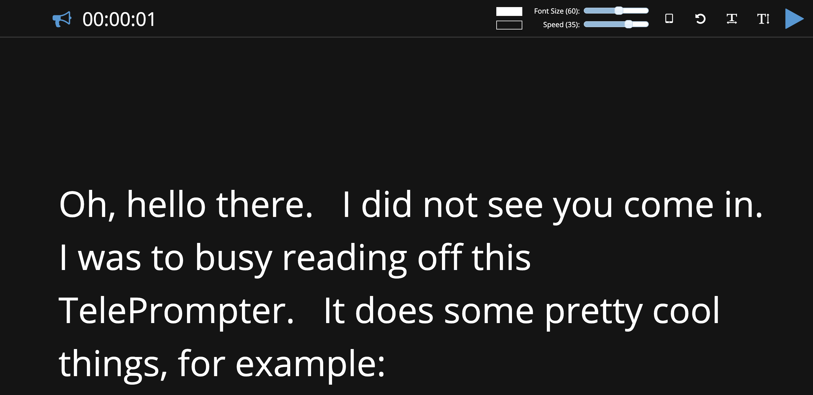

# docker-teleprompter

A teleprompter application hosted in a docker container. Enter your own text and away you go.




## Usage

Modify the ```config.env``` and ```deploy.env``` to suit your needs from a version and repo perspective.

To build: ```make build```
To run:	```make run```


## Additional References

Based on work from [Manifest Interactive](https://github.com/manifestinteractive/teleprompter).  Also available online at [https://promptr.tv](https://promptr.tv)